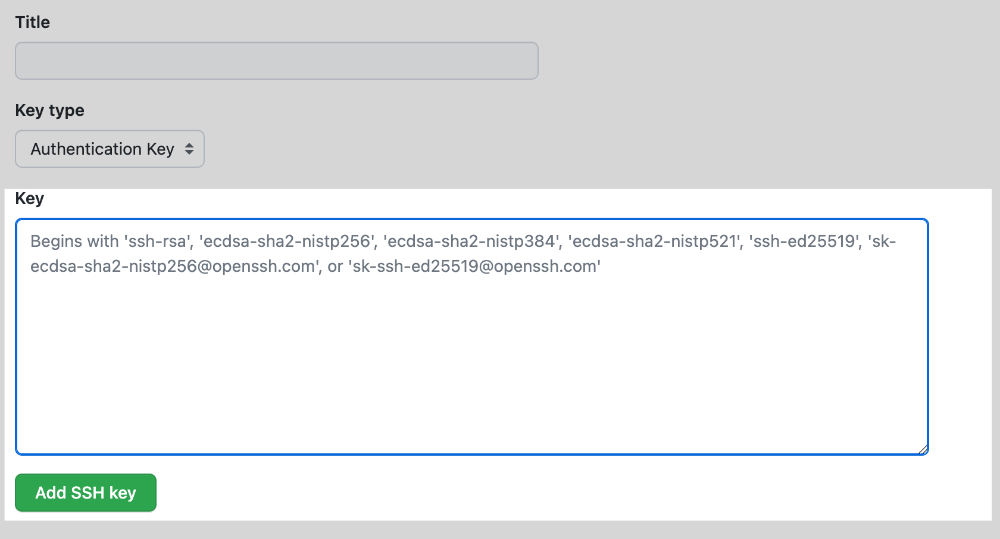

# Django Project Template

The clean, fast and right way to start a new Django `1.10.1` powered website.

**Table of Contents**
1. [Get Started](#get-started)  
    1.1 [Install Termux](#install-termux)  
    1.2 [Install Python](#install-python)  
    1.3 [Install Git](#install-git)  
2. [Project Setup](#project-setup)  
    2.1 [Local Directory](#local-directory)  
    2.2 [Virtual Environment](#virtual-environment)  
    2.3 [Install Django](#install-django)  
3. [Django Setup](#django-setup)  
    3.1 [Start Project](#start-project)  
    3.2 [Create Superuser](#create-superuser)  
    3.3 [Start App](#start-app)  
    3.5 [Ser](#7jh)
4. [SSH setup](#ssh-setup) 
    4.1 [About ssh](#about-ssh) 
    4.3 [Add sshKey to SSH agent](#add-sshKey-to-SSH-agent)
    4.4 [Add sshkey to git account](#add-sshkey-to-git-account)

## Get Started 
### Install Termux
Install [Termux](https://termux.com/), launch and update it.

**Update & upgrade**
```
pkg update && pkg upgrade
```
You can use the [apt command](https://en.wikipedia.org/wiki/APT_(Debian)) if your prefer. 
```
apt update && apt upgrade
```
#### Setup External Storage
Create a storage directory to access other areas of the device.
```
termux-setup-storage
```
### Install Python
```
pkg install python
```

### Install Git
```
pkg install git
```

## Project Setup

### Local Directory
Change directories to the newly created `storage` folder.
```
cd storage
```

Create a directory to store our project files.
```
mkdir myapp && cd myapp
```

### Virtual Environment
Now that we are in our newly created project folder it's time to setup a [virtual environment](https://docs.python.org/3/tutorial/venv.html) for our app.

#### Create Virtual Environment
```
python -m venv your_env_name
```


#### Activate Virtual Environmemt

```
source your_env_name/bin/activate.
```


**Tip**: Close out of a virtual environment by typing `deactivate` and then hitting <kbd>Enter</kbd>

### Install Django
Our virtual environment is activated and we're ready to install Django.

```
pip install django
```

**Save installed packages to a text file**
```
pip freeze > requirements.txt
```

```
pip install -r requirements.txt
```
<kbd>or</kbd>
```
$ pip install -r https://github.com/prabhu1122/Login_Auth_Django/blob/main/requirements.txt

```

## Django Setup

### Start Project
Tell Django admin to start a new project with your project name.

```
django-admin startproject <project_name>
```

### Create Superuser
It will create a django database and give the access to database
```
python manage.py createsuperuser

```
We can fill these credentials according to our preferences:
* Username: `testAdminUser`
* Email address: `test@gmail.com`
* Password: `********`
* Password (again): `********`

**Tip**: after clicking <kbd>Enter</kbd>, enter `y` then press hit <kbd>Enter</kbd>

Change into the Django project directory to view the files Django generated
```
cd <project_name>
```
### Start App
Tell Django to run a local server and watch for changes
```
python manage.py runserver
```
Open your web browser and navigate to `localhost:8000` to confirm the Django app is running successfully!
We can access the admin panel of superuser at  `http://127.0.0.1:8000/admin/`

**Tip**: Stop the local server from running by hitting <kbd>CTRL</kbd>+<kbd>c</kbd>

## Technologies
This project is created with:
* `python 3.10.1`
* `django 4.0`
* `git 2.0.1`


## SSH setup

### About SSH
Using the SSH protocol, you can connect and authenticate to remote servers and services. With SSH keys, you can connect to GitHub without supplying your username and personal access token at each visit. You can also use an SSH key to sign commits.

### Check existing <kbd>[ssh_Keys](https://docs.github.com/en/authentication/connecting-to-github-with-ssh/about-ssh)</kbd>

**1** Open Terminal.

Enter ```ls -al ~/.ssh ``` to see if existing SSH keys are present.

Lists the files in your .ssh directory, if they exist
Check the directory listing to see if you already have a public SSH key. By default, the filenames of supported public keys for GitHub are one of the following.

* `id_rsa.pub`
* `id_ecdsa.pub`
* `id_ed25519.pub`

if no above like file available then try follow

### Generate ssh_key
Paste the text below, substituting in your GitHub email address.

```ssh-keygen -t ed25519 -C "your_email@example.com"```

**Note**: If you are using a legacy system that doesn't support the Ed25519 algorithm, use:

```ssh-keygen -t rsa -b 4096 -C "your_email@example.com"```

This creates a new SSH key, using the provided email as a label.
Generating public/private ALGORITHM key pair.
When you're prompted to "Enter a file in which to save the key", you can press Enter
type the default file location and replace id_ssh_keyname with your custom key name.

```
>Enter a file in which to save the key (/home/YOU/.ssh/ALGORITHM):[Press enter]
```
At the prompt, type a secure passphrase. For more information, see "Working with SSH key passphrases."

```
> Enter passphrase (empty for no passphrase): [Type a passphrase]
> Enter same passphrase again: [Type passphrase again]

```
#### Start the ssh-agent in the background.

```eval "$(ssh-agent -s)"```
Agent pid 59566


### Add sshKey to SSH agent

``` ssh-add ~/.ssh/id_ed25519 ```


### Add sshkey to git account

```cat ~/.ssh/id_ed25519.pub```

Then select and copy the contents of the id_ed25519.pub file
displayed in the terminal to your clipboard

In the upper-right corner of any page, click your profile photo, then click Settings.


Settings icon in the user bar

In the "Access" section of the sidebar, click  **SSH and GPG keys**.


Click **New SSH key** or **Add SSH key**.

SSH Key button


In the *"Title"* field, add a descriptive label for the new key. For example, if you're using a personal laptop, you might call this key "Personal laptop".

Select the type of key, either authentication or signing. For more information about commit signing, see "About commit signature verification."

Paste your key into the *"Key"* field.

The key field


Click **Add SSH key**.


### Testing your SSH connection


## How to get
Just download zip file of it and use in your code


